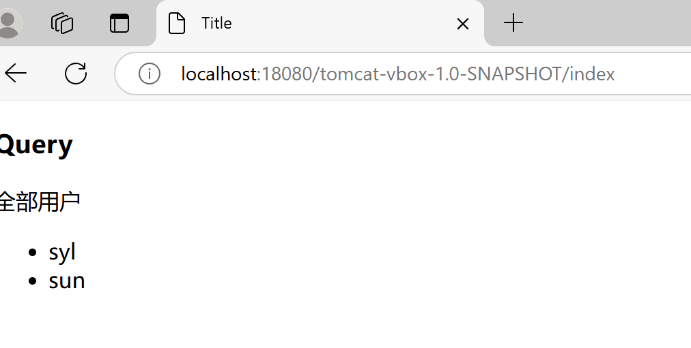
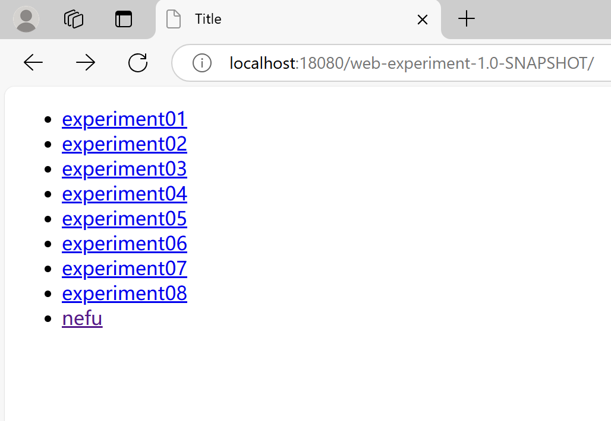
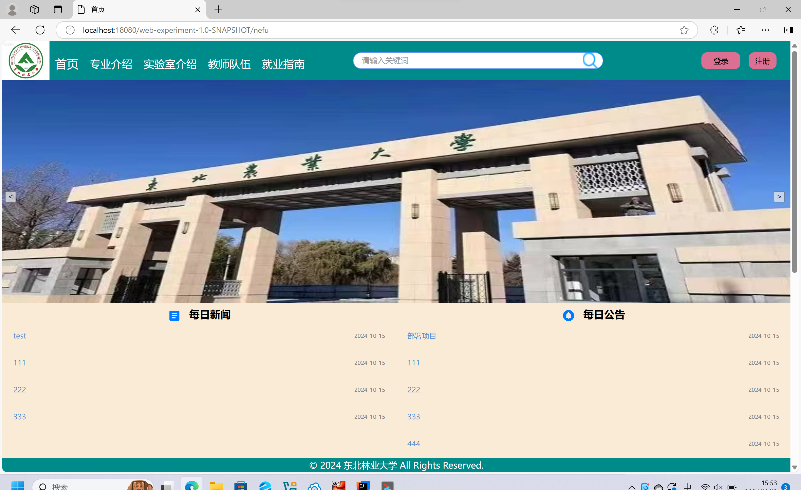

# Linus-docker
### Outline：本仓库用于记录各种技术栈学习过程  
### 一. mysql
**Process**  

Update  : 2024.9.22  

1、下载安装virtual box  
CentOS-7-x86_64-DVD-2207-02.iso
https://mirrors.aliyun.com/centos/7.9.2009/isos/x86_64/  
2.安装虚拟机  
https://blog.csdn.net/qq_43726042/article/details/105913613  
3.在linux中安装docker 方便封装和部署 每一个容器是linus操作系统内核    
https://docs.docker.com/engine/install/centos/  
4.sudo yum install -y yum-utils 报错问题  
https://blog.csdn.net/weixin_43490087/article/details/141924032 4步检查 yum源换成国内镜像源
https://blog.csdn.net/superiony/article/details/140505523 修改仓库  
https://blog.csdn.net/jingling555/article/details/140361046?ops_request_misc=%257B%2522request%255Fid%2522%253A%25220D2EEF54-39C8-4EEC-803F-E05008D7C36B%2522%252C%2522scm%2522%253A%252220140713.130102334.pc%255Fblog.%2522%257D&request_id=0D2EEF54-39C8-4EEC-803F-E05008D7C36B&biz_id=0&utm_medium=distribute.pc_search_result.none-task-blog-2~blog~first_rank_ecpm_v1~rank_v31_ecpm-1-140361046-null-null.nonecase&utm_term=docker&spm=1018.2226.3001.4450  
5.获取密钥失败问题  
重新更换镜像  

6、hello world运行失败或超时 配置阿里云镜像加速器失败  
https://blog.csdn.net/quanqxj/article/details/79479943/ 添加可用ip(不知道是否有用）  
https://www.cnblogs.com/paul-liang/p/18384633 配置加速地址  
7.Could not resolve host: github.com解决方法
https://blog.csdn.net/lxcw_sir/article/details/135958573  
8.安装ssh 主机与虚拟机互通 配置网络 端口映射  
https://www.cnblogs.com/albelt/p/17020773.html  

Update  : 2024.9.24 

9.vbox生成备份  
https://www.jianshu.com/p/ba27c0fd2edf  
10.实现虚拟机和主机进行互通 利用docker-compose安装mysql，在ideal通过之前主机13306端口映射centos 3306端口连接虚拟机数据库等  
在mysql目录下创建compose脚本，拉取mysql镜像，cd进入mysql目录，  
docker exec -it 容器名 bash 进入bash命令行 运行mysql -uroot -p   
通过输入密码进入mysql 可以完成在ideal建表在这里查看。  
11. 拉取tomcat失败 返回之前的备份 重新拉取mysql 

**Command** 

- 启动 docker : systemctl start docker
- 关闭 docker : systemctl stop docker
- 重新启动 docker : systemctl restart docker
-  docker 设置自启动 : systemctl enable docker
-  查看 docker 运行状态 : systemctl status docker
- 查看 docker 版本号等信息 : docker version 或 docker info
- docker 帮助 ： docker --help
- 查看镜像 ： docker images
- 搜索镜像 ：
  docker search [OPTIONS] 镜像名字  
  docker search mysql
- 拉取镜像 ：
  docker pull  
  docker pull mysql #没有制定版本则默认最新版
- 运行镜像 ：
  docker run 镜像名字
- 删除镜像 ：
  docker rmi  镜像名/镜像ID #若镜像在运行则会报错  
  docker rmi -f 镜像名/镜像ID #强制删除一个 删除多个 其镜像ID或镜像用用空格隔开即可  
docker rmi -f $(docker images -aq)  
删除全部镜像  -a 意思为显示全部, -q 意思为只显示ID
- 加载镜像：
  docker load -i 镜像保存文件位置
-  保存镜像：
   docker save 镜像名/镜像ID -o 镜像保存位置和名字
- 查看正在运行的容器 ：
  docker ps  
  docker ps -a # 查看所有容器  
  #加格式化方式访问，格式会更加清爽  
  docker ps --format "table {{.ID}}\t{{.Image}}\t{{.Ports}}\t{{.Status}}\t{{.Names}}"
- 创建容器：
  docker run [OPTIONS] IMAGE [COMMAND] [ARG...]
- 停止容器：
  docker stop 容器名
-  启动容器：
   docker start 容器名
- 进入正在运行的容器：
  docker exec -it 容器名 bashshell
- 强制停止容器：
  docker kill 容器名
- 查看容器日志：
  docker logs 容器名
- 查看容器内部细节：
  docker inspect 容器名
- 创建容器数据卷挂载：
创建容器并指定数据卷，注意通过 -v 参数来指定数据卷  
docker run -d --name nginx -p 80:80 -v html:/usr/share/nginx/html nginx  
- 删除数据卷:
  docker volume rm 数据卷名
- 修改mysql密码命令:  
flush privileges;  
alter user 'root'@'localhost' identified by '新密码';exit退出  
- 脚本命令：
~~~
services:
  public-mysql:
    restart: always
    image: mysql:8
    container_name: mysql
    volumes:
      - ./data/:/var/lib/mysql/
    environment:
      TZ: Asia/Shanghai
      MYSQL_ROOT_PASSWORD: 123456
    command:
      --max_connections=2500
    ports:
      - 3306:3306
~~~
### 二. tomcat

**Process**  

Update  : 2024.9.26 

1. 新建web项目  声明war包和相关依赖以及新建webapp文件夹 添加tomcat配置
~~~
 <dependencies>
        <!-- https://mvnrepository.com/artifact/jakarta.servlet/jakarta.servlet-api -->
        <dependency>
            <groupId>jakarta.servlet</groupId>
            <artifactId>jakarta.servlet-api</artifactId>
            <version>6.0.0</version>
            <scope>provided</scope>
        </dependency>
    </dependencies>

    <build>
        <plugins>
            <!-- https://mvnrepository.com/artifact/org.apache.maven.plugins/maven-war-plugin -->
            <plugin>
                <groupId>org.apache.maven.plugins</groupId>
                <artifactId>maven-war-plugin</artifactId>
                <version>3.3.2</version>
            </plugin>
        </plugins>
    </build>
~~~
2. 拉取tomcat10.1和java21的镜像 编写脚本 映射端口  
Error response from daemon: Get https://index.docker.io/v1/search?q=zookeeper&n=25: dial tcp: lookup index.docker.io on 192.168.xxx.x:xx: read udp 192.168.xx.xx:xxxxx->192.168.xx.xx:xxxx: i/o timeout  
https://blog.csdn.net/weixin_43608968/article/details/133814361  
3. 运行脚本命令  
首先要进入脚本所在目录 之后在运行脚本   
运行脚本出错 validating /home/services/tomcat/docker-compose.yaml: (root) Additional prop  
原因是yaml格式缩进问题 要仔细  
4. Error response from daemon: Get "https://registry-1.docker.io/v2/": net/http  
可能是网络问题 https://blog.csdn.net/m624197265/article/details/141719515  
https://blog.csdn.net/jks212454/article/details/126326299  
 https://blog.csdn.net/qq_52712971/article/details/141862621  
重启docker出错 Job for docker.service failed because the control process exited with error
https://blog.csdn.net/weixin_46214729/article/details/140790837  
5. Failed to restart docker.service: Unit is not loaded properly: Invalid argum
https://blog.csdn.net/qq_36639113/article/details/138846529  
发现daemon配置文件多加了一个，
6. 发现最新加速地址 https://blog.csdn.net/llc580231/article/details/139979603#:~:text=%E7%BD%91%E6%98%93%E9%95%9C%E5%83%8F%E4%B8%AD%E5%BF%83%EF%BC%9Ahtt

Update  : 2024.10.8 

7. 拉取tomcat失败 返回之前的备份！ 运用脚本重新拉取mysql和tomcat  
8. 复制war包到webapps包下 它会自动解压 可以ls查看解压之后的目录 之后就可以在游览器访问   
https://github.com/bwhyman/linux-docker-examples/tree/master/examples  

**完毕完毕！**

   **Command** 
- 运行脚本: docker compose up -d
- 关闭脚本：docker compose down  
脚本：
~~~
services:
  tomcat:
    image: tomcat:10.1-jdk21
    volumes:
      - ./webapps/:/usr/local/tomcat/webapps/
      - ./logs/:/usr/local/tomcat/logs/
    environment:
      TZ: Asia/Shanghai
    ports:
      - 8080:8080
~~~
- 更改加速地址之后：  
  sudo systemctl daemon-reload
  sudo systemctl restart docker
  systemctl status docker

### 三. 整合tomcat和 mysql

**Process**  

Update  : 2024.10.13 
1. 在services目录下创建web-project服务目录，编写脚本整合mysql+tomcat2个子服务 tomcat声明依赖mysql服务和开启健康监测
~~~
services:
  mysql:
    image: mysql:8
    restart: always
    ports:
      - 3307:3306
    volumes:
      - ./mysql/data/:/var/lib/mysql/
    environment:
      TZ: Asia/Shanghai
      MYSQL_ROOT_PASSWORD: 123456
    command:
      --max_connections=2500
    healthcheck:
      # test: mysql --user=root --password=1157 -e "select 1;"
      test: mysql -uroot -p$$MYSQL_ROOT_PASSWORD -e "select 1;"
      interval: 10s
      timeout: 3s
      retries: 3
  tomcat:
    image: tomcat:10.1-jdk21
    depends_on:
       mysql:
          condition: service_healthy
    volumes:
      - ./webapps/:/usr/local/tomcat/webapps/
      - ./logs/:/usr/local/tomcat/logs/
    environment:
      TZ: Asia/Shanghai
    ports:
      - 8080:8080

~~~
2. 在之前的tomcat项目中添加jdbc依赖等等 编写context.xml文件声明数据源配置 数据源地址为和初始化数据库
~~~
<?xml version="1.0" encoding="UTF-8" ?>
<Context>
    <Resource name="jdbc/MySQL" type="javax.sql.DataSource" maxTotal="100" maxIdle="30"
            maxWaitMillis="10000" initialSize="1" username="root" password="123456" driverClassName="com.mysql.cj.jdbc.Driver"
            url="jdbc:mysql://127.0.0.1:13306/syl"
    />

</Context>
~~~
重新打包部署到服务器 容器运行起来才能自动解压  
浏览器http://localhost:18080/tomcat-vbox-1.0-SNAPSHOT
3. 创建容器测试一下 创建表看看网页能否显示数据库内容 建立servlet和jsp 结果显示失败
4. Cannot create JDBC driver of class '' for connect URL 'null'  
感觉是之前mysql容器还在用3306端口运行 没有停掉然后出现端口冲突 所以创建容器用3307端口映射3306端口 然后没有在虚拟机配置13307映射3307 决定将容器删掉重来  
docker compose -f docker-compose.yaml down -v 同时删掉数据卷 再删除日志和mysql数据  rm -r 太多了删不完 rm -rf 这个一键删除
5. java.net.ConnectException: Connection refused: connection  
   原来是虚拟机未开启 没有联网
6. 将之前mysql容器停掉 用3306映射3306创建新的容器 还是没有成功显示 驱动问题仍然存在

Update  : 2024.10.15 
7. context url应该写成mysql：3306 因为是两个容器之间访问 利用compose就可以通过services中声明的名称加端口访问
8. 啊啊啊啊 原来是把MEAT-INF写成WETA-INF了 改完了就对了 啊啊啊

9. docker compose 为多子服务创建网络实现互交访问  
https://blog.csdn.net/feiying0canglang/article/details/127991493
10. 注意生产环境下和部署环境下context文件中url数据库地址和端口  
部署mysql：3306  生产127.0.0.1：13306

部署之前的项目  访问http://localhost:18080/web-experiment-1.0-SNAPSHOT

nefu系统

**完毕完毕！**

**Command** 

- 删除容器加数据卷： docker compose -f docker-compose.yaml down -v  
- rm -r 效率太低
- rm -rf 一键删除

### 四. 整合前后端

**Process**  

Update  : 2024.10.19  

